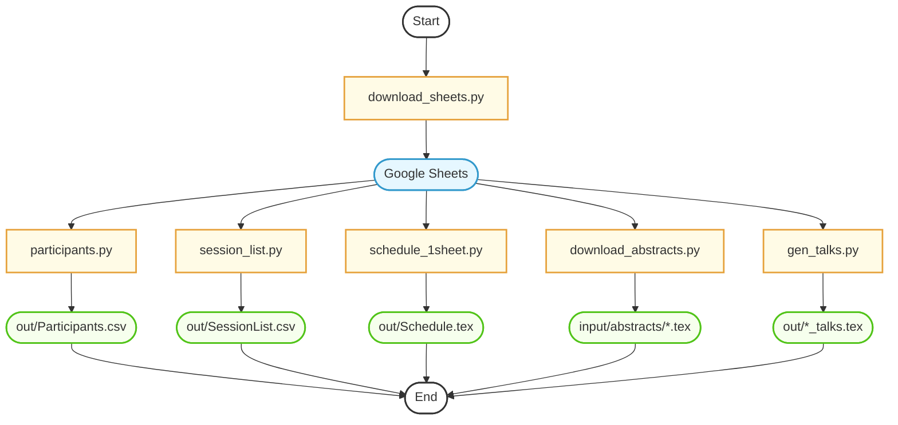

# README

## Goal

The following are input Google Sheets for MCM 2025. We need to convert them into the input format required by 
`MCM2025Data.xlsx`:

*   MCM 2025 Schedule: [https://tinyurl.com/4pj6dez7](https://docs.google.com/spreadsheets/d/1GR7LoeFuSbpomrHPnWqR9soJVkIkh56AAbAGx5zQGr4/edit?gid=0#gid=0)
*   Plenary Talk Abstracts: [https://tinyurl.com/2ttw4t4c](https://docs.google.com/spreadsheets/d/1xNO88DO2COTkJ1vOzCXQiTrxKa7_pxW3a2yU06JoDEY/edit?usp=sharing)
*   Special Session Submissions: [https://tinyurl.com/569kcufm](https://docs.google.com/spreadsheets/d/1i6OUgAZSI_evTy0E8X5NUB0IzGwLIjwtu_cSnGwl960/edit?usp=sharing)
	- _First tab, "Form Responses 1"_
	- `Session Title`, column AE
*   Special Session Abstracts: [https://tinyurl.com/n3b6xu48](https://docs.google.com/spreadsheets/d/10o80tZl1f5XGXT4WpqYe7v4nzzFyBEvgUYxDAkT5LlI/edit?usp=sharing)
	- `Special Session Title`, column Z
*   Contributed Talk Submissions: [https://tinyurl.com/383y2kue](https://docs.google.com/spreadsheets/d/1o1WeviV-MTGQMFHqsiAkZwMVOO0_h3GNekgCS2fojGM/edit?gid=429679292#gid=429679292)
	- `SESSION`, column X

## Issues

### File Permissions 
Permissions for the above files have been changed to _Anyone with the link can view_ for reading purposes.

### Input Data Issues with Google Sheets 
* [Schedule](https://github.com/fjhickernell/MCM-2025-Program/blob/main/preprocess/input/schedule.csv):
	- The second-to-last row contains "//". SC has programmatically removed such rows.
	- Choi has two sessions, each with two parts. Currently, there is only one part, and the part number "Part I" is missing. Two Part II sessions are added. 
	- Jing Dong's session is added. 
	- Missing time for RECEPTION and BANQUET — <mark>TODO</mark>
* [Plenary Talk Abstracts](https://github.com/fjhickernell/MCM-2025-Program/blob/main/preprocess/input/plenary_abstracts.csv):
	- So far, there are six plenary talk abstracts. <mark>***Fred has reminded remind them***</ma
* [Special Session Submissions](https://github.com/fjhickernell/MCM-2025-Program/blob/main/preprocess/input/special_session_submissions.csv):
	- The last row contains only "SCHEDULED (by Nathan Kirk)" — this row is removed programmatically by SC.
	- Added Jing Dong's session to the Google Sheet manually.
	- Jing Dong's session is missing the abstract .tex source, waiting for Chang-Hang — DONE
	- Added two of Sou-Cheng Choi's Part II sessions
	- **NOTE**: S9, S13, S27, S19, S20 has only 3 speakers in each session.
* [Special Session Abstracts](https://github.com/fjhickernell/MCM-2025-Program/blob/main/preprocess/input/special_session_abstracts.csv):
	- Some values are empty in the last column, `Special Session Title`. Zexin's SS title was filled in manually by Fred. SC added the values for Chih-Li,Sung and Mao,Cai. Mao has a duplicate talk.  It is deduplicated programmatically. 
	-  Some special sessions has only two speakers who have sent abstracts:  — <mark>Fred and Mikhail will send them reminders </mark>
      	* Stochastic Optimization 
      	* Recent Progress on Algorithmic Discrepancy Theory and Applications
      	* Recent Advances in Stochastic Gradient Descent 
* [Contributed Talk Submissions](https://github.com/fjhickernell/MCM-2025-Program/blob/main/preprocess/input/contributed_talk_submissions.csv):
	- Some talks are not assigned to a Technical Session in column `SESSION` or contain missing or unusual values like `ADD TO SHANE H. SESSION` and  `//` — <mark>Fred has asked Mikhail to handle these and also fill in column `Paid`</mark>. 
	- **NOTE**: T1, T8, and T9 has only 3 speakers in each session.
	- SC programmatically filtered out rows with `Acceptance` == `Yes`.
  
### Missing Output Data

- SessionList.csv
  * Session IDs are created programmatically
  * Chair names are missing — <mark>TODO fill in column `Chair` in Schedule by Chang-Han or program committee</mark>
  * Room numbers are missing — <mark>TODO fill in column `Room` in Schedule by Chang-Han or program committee</mark>
- Participants.csv
  * Missing organizing committee members and scientific committee members — <mark>TODO </mark>
  * Not sure how to get `PageNumber` — <mark>TODO SC to figure out</mark>
  * Student helpers — <mark>TODO </mark>
  * Paid registered participants who are not presenters/organizers — <mark>Fred will extract from Mail Chimp</mark>

# Workflow

