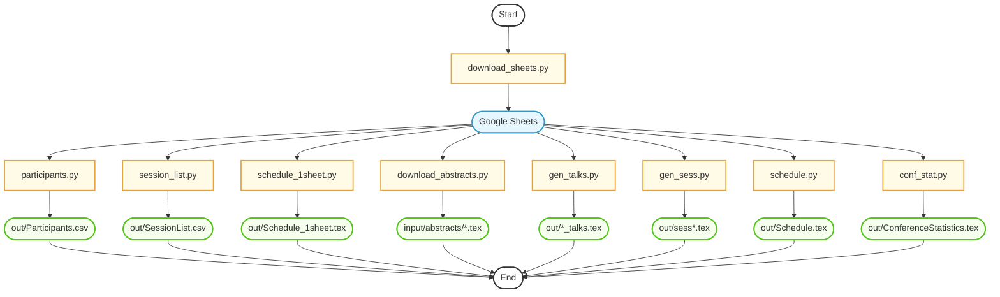

# README

## Goal

The following are input Google Sheets for MCM 2025. We need to convert them into the input format required by 
`MCM2025Data.xlsx`:

*   MCM 2025 Schedule: [https://tinyurl.com/4pj6dez7](https://docs.google.com/spreadsheets/d/1GR7LoeFuSbpomrHPnWqR9soJVkIkh56AAbAGx5zQGr4/edit?gid=0#gid=0)
*   Plenary Talk Abstracts: [https://tinyurl.com/2ttw4t4c](https://docs.google.com/spreadsheets/d/1xNO88DO2COTkJ1vOzCXQiTrxKa7_pxW3a2yU06JoDEY/edit?usp=sharing)
*   Special Session Submissions: [https://tinyurl.com/569kcufm](https://docs.google.com/spreadsheets/d/1i6OUgAZSI_evTy0E8X5NUB0IzGwLIjwtu_cSnGwl960/edit?usp=sharing)
	- _First tab, "Form Responses 1"_
	- `Session Title`, column AE
*   Special Session Abstracts: [https://tinyurl.com/n3b6xu48](https://docs.google.com/spreadsheets/d/10o80tZl1f5XGXT4WpqYe7v4nzzFyBEvgUYxDAkT5LlI/edit?usp=sharing)
	- `Special Session Title`, column Z
*   Contributed Talk Submissions: [https://tinyurl.com/383y2kue](https://docs.google.com/spreadsheets/d/1o1WeviV-MTGQMFHqsiAkZwMVOO0_h3GNekgCS2fojGM/edit?gid=429679292#gid=429679292)
	- `SESSION`, column X

## [Resolved Issues](issues.md)

## Script Descriptions

- `download_sheets.py`: Downloads Google Sheets as CSV files.
- `schedule_1sheet.py`: Creates one-sheet schedule.
- `session_list.py`: Generates the session list CSV.
- `participants.py`: Compiles the participants list.
- `download_abstracts.py`: Downloads abstracts as .tex files.
- `gen_talks.py`: Generates LaTeX files for talks.
- `gen_sess.py`: Generates LaTeX files for sessions.
- `schedule.py`: Processes and formats the complete schedule.
- `conf_stat.py`: Generates conference statistics.

## Workflow

```mermaid
flowchart TD
    Start([Start])
    End([End])

    %% Set node colors
    style Start fill:#fff,stroke:#333,stroke-width:2px
    style End fill:#fff,stroke:#333,stroke-width:2px

    %% Input files
    A3([Google Sheets])
    style A3 fill:#e6f7ff,stroke:#3399cc,stroke-width:2px

    %% Python scripts in preprocess (without util.py, config.py, and schedule_joinfiles.py)
    B3[download_sheets.py]
    B6[schedule_1sheet.py]
    B5[session_list.py]
    B4[participants.py]
	B7[download_abstracts.py]
    B8[gen_talks.py]
    B9[gen_sess.py]
    B10[schedule.py]
    B11[conf_stat.py]
    style B3 fill:#fffbe6,stroke:#e6a23c,stroke-width:2px
    style B4 fill:#fffbe6,stroke:#e6a23c,stroke-width:2px
    style B5 fill:#fffbe6,stroke:#e6a23c,stroke-width:2px
    style B6 fill:#fffbe6,stroke:#e6a23c,stroke-width:2px
	style B7 fill:#fffbe6,stroke:#e6a23c,stroke-width:2px
    style B8 fill:#fffbe6,stroke:#e6a23c,stroke-width:2px
    style B9 fill:#fffbe6,stroke:#e6a23c,stroke-width:2px
    style B10 fill:#fffbe6,stroke:#e6a23c,stroke-width:2px
    style B11 fill:#fffbe6,stroke:#e6a23c,stroke-width:2px

    %% Outputs
    O1([out/Participants.csv])
    O2([out/SessionList.csv])
    O4([out/Schedule_1sheet.tex])
	O5([input/abstracts/*.tex])
    O6([out/*_talks.tex])
    O7([out/sess*.tex])
    O8([out/Schedule.tex])
    O9([out/ConferenceStatistics.tex])
    style O1 fill:#f6ffed,stroke:#52c41a,stroke-width:2px
    style O2 fill:#f6ffed,stroke:#52c41a,stroke-width:2px
    style O4 fill:#f6ffed,stroke:#52c41a,stroke-width:2px
	style O5 fill:#f6ffed,stroke:#52c41a,stroke-width:2px
    style O6 fill:#f6ffed,stroke:#52c41a,stroke-width:2px
    style O7 fill:#f6ffed,stroke:#52c41a,stroke-width:2px
    style O8 fill:#f6ffed,stroke:#52c41a,stroke-width:2px
    style O9 fill:#f6ffed,stroke:#52c41a,stroke-width:2px

    %% Flow
    Start --> B3
    B3 --> A3
    A3 --> B5
    A3 --> B4
    A3 --> B6
	A3 --> B7
    A3 --> B8
    A3 --> B9
    A3 --> B10
    A3 --> B11

    B4 --> O1
    B5 --> O2
    B6 --> O4
	B7 --> O5
    B8 --> O6
    B9 --> O7
    B10 --> O8
    B11 --> O9

    O1 --> End
    O2 --> End
    O4 --> End
	O5 --> End
    O6 --> End
    O7 --> End
    O8 --> End
    O9 --> End

```